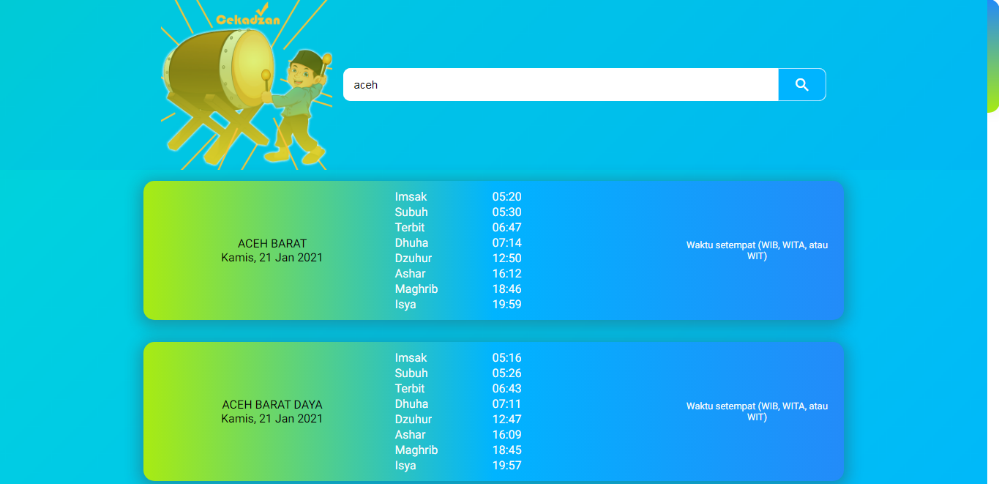

# Cekadzan Web 

    

## Contents

- [Description](#description)
- [Features](#features)
- [Requirements](#requirements-for-development)
- [Installation](#installation-for-development)
- [Screenshoots](#screenshoots)
- [Demo Cekadzan](#demo-cekadzan)
- [Reference](#reference)

## Description

**Cekadzan** is a simple website for checking imsakiyah schedules (imsak, prayer, etc). Use api from the [API Fathimah Bot](https://fathimah.docs.apiary.io/) and built with Angular. This web can be added on mobile home screen.

## Features

- check the Imsakiyah schedule in cities or districts in Indonesia

## Requirements for Development

- [`Node Js`](https://nodejs.org/en/)
- [`npm`](https://www.npmjs.com/get-npm)
- [`Angular`](https://angular.io/)

## Installation for Development

1. Open your terminal or command prompt
2. Type `git clone https://github.com/solehudin5699/CekAdzan.git`
3. Open the folder and type `npm install` for install dependencies
4. Type `ng serve` in terminal for running this project. Navigate to `http://localhost:4200/`. The app will automatically reload if you change any of the source files.
5. If you want to build, run `ng build` to build the project. The build artifacts will be stored in the `dist/` directory. Use the `--prod` flag for a production build.
6. To get more help on the Angular CLI use `ng help` or go check out the [Angular CLI Overview and Command Reference](https://angular.io/cli) page.

## Screenshoots

    

## Demo Cekadzan

Try Cekadzan Web build version below

## Reference

- Reference icon app (before modification) : [visit](https://www.freepik.com/premium-vector/cartoon-muslim-boy-hitting-bedug_7815352.htm)
